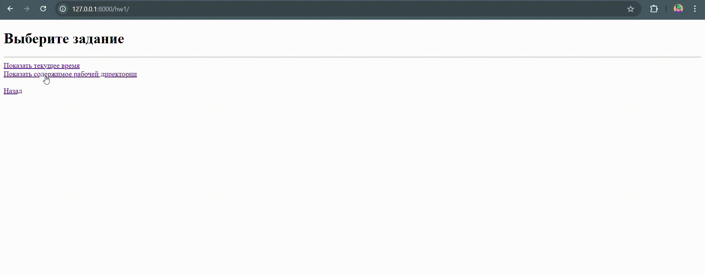

# Задания:

- [Знакомство с Django. Подготовка и запуск проекта](#hw1-знакомство-с-django-подготовка-и-запуск-проекта)
- [Обработка запросов и шаблоны](#hw2-обработка-запросов-и-шаблоны)
- [Работа с ORM](#hw3-работа-с-orm)
- [Работа с ORM, 2 часть](#работа-с-orm-2-часть)

## HW1: Знакомство с Django. Подготовка и запуск проекта

#### Функционал:

- Общие настройки проекта `settings.py`
- Базовые классы представлений и универсальные шаблоны
- Меню с навигацией для просмотра выполненных заданий
- Отображение текущего времени и содержимого рабочей директории проекта

#### Маршрутизация:

| URL                  | 
|----------------------|
| `/hw1/`              |
| `/hw1/current_time/` |
| `/hw1/workdir/`      | 

#### Визуализация:



## HW2: Обработка запросов и шаблоны

#### Функционал:

- Inline-форма в панеле админстратора для взаимодействия c БД
- Список кулинарных рецептов с пагинацией `?page=`
- Детальная страница каждого рецепта с ингредиентами 
- Пересчет количества ингредиентов через параметр порций `?servings=`
- Навигация с возможностью вернуться на последнюю просмотренную страницу

#### Загрузка тестовых данных:

```
python manage.py loaddata hw2/recipes.json
```

#### Схема БД:


#### Маршрутизация:

| URL                                     | 
|-----------------------------------------|
| `/admin/hw2/`                           |
| `/hw2/`                                 |
| `/hw2/recipes/?page=`                   |
| `/hw2/recipes/<slug-recipe>/?servings=` | 

#### Визуализация:


## HW3: Работа с ORM

#### Функционал:

- Кастомная команда управления для взаимодействия c БД
- Каталог смартфонов с сортировкой по параметру `?sort=`
- Детальная страница каждого смартфона
- Навигация с возможностью вернуться на последнюю просмотренную страницу

#### Загрузка тестовых данных:

```
python manage.py import_phones <название_приложения>
```


#### Схема БД:


#### Маршрутизация:

| URL                          | 
|------------------------------|
| `/hw3/`                      |
| `/hw3/catalog/?sort=name`    | 
| `/hw3/catalog/?sort=price`   | 
| `/hw3/catalog/?sort=-price`  | 
| `/hw3/catalog/<slug-phone>/` | 

#### Визуализация:


## Работа с ORM, 2 часть


